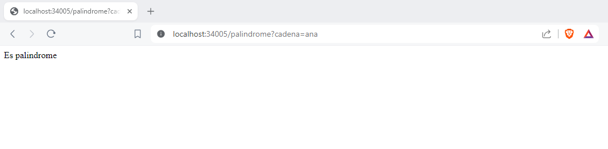
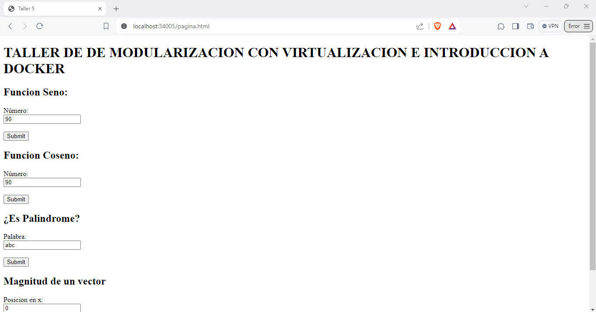

# Taller 05: Modularización con virtualización e introducción a Docker

Este taller es la creación de una aplicación web pequeña usando el micro-framework de Spark en Java (http://sparkjava.com/). Una vez creada esta se procedió a construir un container en Docker para así desplegar y configurar la maquina local. Por último se creo un repositorio en DockerHub en donde se subió la imagen. 

*Aplicación web*
La aplicación consta de una serie de formularios donde:
* Devuelve el seno y coseno de un número.
* Indica si una palabra es palíndrome.
* Retorna la magnitud real de un vector de dos dimensiones. 


## Prerequisitos
Los prerrequisitos tecnológicos que necesita este taller son:

* [Maven](https://maven.apache.org/): Maven es un herramienta que proporciona una estructura estándar, gestión de dependencias y automatización de tareas en los proyectos software desarrollados en Java.

* [GitHub](https://platzi.com/blog/que-es-github-como-funciona/): Es una plataforma de desarrollo colaborativo basado en Git que utiliza un sistema de versiones distribuida para el seguimiento del código fuente durante el desarrollo.

* [Java 8](https://www.java.com/es/download/help/java8_es.html): Es un lenguaje de programación de propósito general, orientado a objetos y diseñado para ser independiente de la plataforma.

* [Docker Hub](https://hub.docker.com/): Es un servicio en la nube proporcionado por Docker que actúa como un repositorio centralizado para imágenes Docker. Es un lugar donde los desarrolladores pueden almacenar, distribuir y compartir imágenes Docker públicas y privadas, así como colaborar en proyectos relacionados con Docker.

* [Docker Desktop](https://www.docker.com/products/docker-desktop/): Es una aplicación de escritorio que proporciona una experiencia unificada para desarrollar, implementar y administrar aplicaciones en contenedores Docker en sistemas operativos Windows y macOS.


## Instalación
1. Clone el repositorio:
```
git clone https://github.com/AREP-2024/Taller5.git
```
2. Aceda a la carpeta principal del repositorio que acaba de clonar:
```
cd Taller5
```
3. Se hace la construcción del proyecto: 
```
 mvn package
```

## Corriendo
1. Si usted desea correr el proyecto de forma local debe ejecutar los siguientes comandos:

### Windows
```
 mvn exec:java -"Dexec.mainClass"="edu.escuelaing.arep.ASE.app.SparkWebServer"
```

### Linux
```
 mvn exec:java -Dexec.mainClass="edu.escuelaing.arep.ASE.app.SparkWebServer"
```

* Para comprobar la función **sin**:
```
http://localhost:4567/sin?num=1
```


* Para comprobar la función **cos**:
```
http://localhost:4567/cos?num=1
```


* Para comprobar la función **Palíndrome**:
```
http://localhost:4567/palindrome?cadena=hola
```


* Para comprobar la función de **la magnitud real de un vector de dos dimensiones**:
```
http://localhost:4567/magnitud?x=3&y=4
```


* Para poder ver la pagina principal con todas las funcionalidades: 
```
http://localhost:4567/pagina.html
```


2. Si usted desea correr el proyecto utilizando la imagen de Docker use los siguientes pasos:
    * Bajar la imagen desde **DockerHub** con este comando
    ```
      docker pull luisagiron/firstsprkwebapprepo:latest
    ```
    * Luego ponemos a correr la imagen con:
    ```
      docker run -d -p 34005:46000 --name mycontainer luisagiron/firstsprkwebapprepo
    ```
L
* Para comprobar la función **sin**:
```
http://localhost:34005/sin?num=90
```

* Para comprobar la función **cos**:
```
http://localhost:34005/cos?num=90
```


* Para comprobar la función **Palíndrome**:
```
http://localhost:34005/palindrome?cadena=ana
```


* Para comprobar la función de **la magnitud real de un vector de dos dimensiones**:
```
http://localhost:34005/magnitud?x=9&y=1
```


* Para poder ver la pagina principal con todas las funcionalidades: 
```
http://localhost:34005/pagina.html
```


**Nota: recuerde cambiar los valores de los atributos si así lo desea para que usted pueda validar la funcionalidad con diferentes valores.**

## Corriendo Test
Se ejecuta el siguiente comando:
```
mvn test
```

## Arquitectura del programa

Dentro de esta arquitectura podrá encontrar los siguientes paquetes:

* src\main\java\edu\escuelaing\arep\ASE\APP: En este usted podrá encontrar las tres clases principales del aplicativo:
    * La clase **SparkWebServer** que es el servidor web.
    * La clase **Calculadora** donde se encuentra toda la lógica de las operaciones solicitadas para los formularios (sin, cos y la magnitud real de un vector de dos dimensiones).
    * La clase **Palíndromo** donde se encuentra la lógica para indicar si una clase es palíndrome o no. 

* Dentro de este mismo paquete se creo resources\public donde se encuentran todos los archivos estáticos como lo son:
    * **pagina.html** que es el formulario de la aplicación.
    * **pagina.js** donde se encuentra la lógica de la interacción de la pagina principal con web server. 

* test\java\edu\escuelaing\arep\ASE\app: En este usted podrá encontrar las pruebas de unidad tanto de la clase Calculadora como de la clase Palindorme.

## Construido con

* [Maven](https://maven.apache.org/): Maven es un herramienta que proporciona una estructura estándar, gestión de dependencias y automatización de tareas en los proyectos software desarrollados en Java.

* [GitHub](https://platzi.com/blog/que-es-github-como-funciona/): Es una plataforma de desarrollo colaborativo basado en Git que utiliza un sistema de versiones distribuida para el seguimiento del código fuente durante el desarrollo.

* [Java 8](https://www.java.com/es/download/help/java8_es.html): Es un lenguaje de programación de propósito general, orientado a objetos y diseñado para ser independiente de la plataforma.

* [Spark](https://sparkjava.com/):Spark es un framework de Java que permite desarrollar aplicaciones web. Se caracteriza por ser super sencillo y muy ligero.

* [Docker](https://www.docker.com/): Es una plataforma de código abierto diseñada para facilitar la creación, implementación y ejecución de aplicaciones en contenedores.

* [Docker Hub](https://hub.docker.com/): Es un servicio en la nube proporcionado por Docker que actúa como un repositorio centralizado para imágenes Docker. Es un lugar donde los desarrolladores pueden almacenar, distribuir y compartir imágenes Docker públicas y privadas, así como colaborar en proyectos relacionados con Docker.

* [Docker Desktop](https://www.docker.com/products/docker-desktop/): Es una aplicación de escritorio que proporciona una experiencia unificada para desarrollar, implementar y administrar aplicaciones en contenedores Docker en sistemas operativos Windows y macOS.

* [Visual Studio Code](https://code.visualstudio.com/):Es un entorno de desarrollo integrado (IDE) ligero y de código abierto desarrollado por Microsoft.

* [HTML](https://developer.mozilla.org/es/docs/Web/HTML): Es el lenguaje de marcado que se utiliza para crear páginas web. Se define como un conjunto de etiquetas que se utilizan para estructurar y dar significado al contenido de una página web.

* [JavaScript](https://aws.amazon.com/es/what-is/javascript/): Es un lenguaje de programación de alto nivel, interpretado y orientado a objetos. Se utiliza principalmente en el desarrollo web para crear páginas web interactivas y dinámicas.


## Autor
[Luisa Fernanda Bermudez Giron](https://www.linkedin.com/in/luisa-fernanda-bermudez-giron-b84001262/) - [Luisa Fernanda Bermudez Giron](https://github.com/LuisaGiron)

## Licencia 
**©** Luisa Fernanda Bermudez Giron, Estudiante de Ingeniería de Sistemas de la Escuela Colombiana de Ingeniería Julio Garavito.
